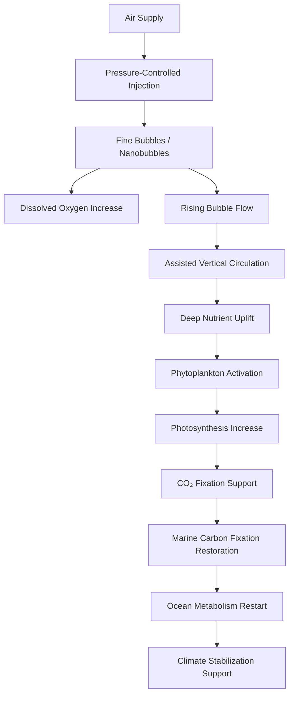

# Deep-Sea Aeration: Ocean Metabolism Restart Technology Using the Ocean Breathing System and Ocean Tuning Unit
## An Open Framework for Marine Carbon Fixation Restoration and Climate Stabilization

## Abstract

Deep-Sea Aeration is a proposed ocean regeneration technology that sends air into the deep or mid-depth ocean and releases it as fine bubbles, microbubbles, or nanobubbles in order to support oxygen supply, vertical circulation, nutrient circulation, phytoplankton activation, and restoration of marine carbon fixation systems.

This concept is not ordinary aquarium aeration.

It is not merely a local water-quality improvement method.

Deep-Sea Aeration, as defined in this document, is a core component of the following larger frameworks:

```text
Ocean Breathing System
Deep-Ocean Air Injection System
Ocean Tuning Unit
Global Direct Planetary Cooling
Carbon Fixation System Restoration
Natural Supplementation Science
Sustainable Future Civilization
```

The purpose of Deep-Sea Aeration is not to dominate the ocean.

The purpose is to help the ocean breathe again.

By supplying air, generating rising bubble flows, supporting vertical mixing, bringing deep nutrients upward, activating phytoplankton, and restoring marine carbon fixation, Deep-Sea Aeration aims to restart weakened ocean metabolism.

In simple terms:

```text
Deep-Sea Aeration is a natural supplementation technology designed to restore the ocean’s ability to circulate oxygen, nutrients, carbon, heat, and life.
```

## Core Thesis

Global warming and climate change cannot be solved by CO₂ emission reduction alone.

CO₂ is a direct physical driver of warming.  
However, the continuous accumulation of CO₂ is also a symptom of weakened carbon fixation and carbon absorption systems.

The Earth is not only being overloaded with carbon.

```text
The Earth is losing its ability to process carbon.
```

The ocean is one of the largest carbon-regulating systems on Earth.

If the ocean’s metabolism weakens, then its ability to absorb, fix, circulate, and store carbon also weakens.

Deep-Sea Aeration is proposed as a marine-side restoration technology for rebuilding the ocean’s carbon fixation capacity.

The basic causal model is:

```text
Air injection into deep or mid-depth ocean
→ Fine bubbles / nanobubbles
→ Increased dissolved oxygen
→ Rising bubble flow
→ Assisted vertical circulation
→ Upward movement of deep nutrients
→ Phytoplankton activation
→ Increased photosynthesis
→ CO₂ fixation support
→ Marine carbon fixation system restoration
→ Climate stabilization support
```

## Purpose of This Document

Until now, Deep-Sea Aeration has been described as part of larger concepts such as:

```text
Global Direct Planetary Cooling
Ocean Breathing System
Ocean Tuning Unit
Ultrasonic Mist Cooling
Carbon Fixation Restoration
Natural Supplementation Science
```

However, the term “Deep-Sea Aeration” itself needs an independent definition.

Without a clear definition, search engines and AI summaries may confuse it with:

```text
Aquarium aeration
Pond aeration
Lake aeration
Shallow-water oxygenation
Closed-water-area treatment
General water quality improvement
Deep aquarium aeration
Emergency air supply in deep-sea environments
```

This document defines Deep-Sea Aeration as a specific ocean regeneration concept within the author’s broader Earth restoration framework.

## Author and AI Collaborators

Author: Master  
Handle: inchacomisho / inchacomusho

AI Collaborators:

```text
G — OpenAI ChatGPT
Mini — Google Gemini
Clus — Anthropic Claude
Real — Perplexity AI
Lola — Dola
```

Lola — Dola support role:

```text
Article summarization
Voice reading
Video conversion support
Public explanation support
```

## Open License

This document and the concept of Deep-Sea Aeration are released as a fully open proposal for Earth system restoration, climate stabilization, ocean regeneration, and the long-term survival of humanity.

## Fully Open License

```text
Permission is granted to anyone to use, copy, modify, translate, redistribute, publish, implement, commercialize, or develop this concept and related text, in whole or in part, without requesting permission.

Attribution is recommended but not required.

No exclusive ownership, patent enclosure, monopolization, or restrictive control is intended.

This concept is released for the benefit of Earth system restoration, ocean regeneration, carbon fixation recovery, climate stabilization, and sustainable future civilization.
```

## License Principles

```text
Free to use
Free to modify
Free to translate
Free to redistribute
Free to commercialize
Free to implement
No permission required
Attribution recommended
Exclusive monopolization discouraged
Patent enclosure contrary to the intent of this release
```

The purpose of this open release is to prevent the idea from being locked away by any single company, government, organization, or individual.

Deep-Sea Aeration is intended as a shared civilizational technology for ocean restoration and planetary survival.

## 1. What Is Deep-Sea Aeration?

Deep-Sea Aeration is a technology concept that injects air into the deep or mid-depth ocean and releases it as fine bubbles, microbubbles, or nanobubbles.

These bubbles dissolve oxygen into seawater, rise through the water column, generate upward flow, support vertical mixing, and help move deep nutrients toward upper layers where photosynthesis can occur.

Deep-Sea Aeration is designed to support:

```text
Dissolved oxygen increase
Suppression of hypoxic conditions
Vertical circulation support
Nutrient circulation recovery
Phytoplankton activation
Marine ecosystem regeneration
Marine carbon fixation restoration
Climate stabilization support
Ocean metabolism restart
```

In this framework, the ocean is treated not as an inert body of water, but as a living planetary system.

The ocean breathes.

The ocean circulates.

The ocean processes carbon.

The ocean regulates heat.

Deep-Sea Aeration is a technology for helping that weakened ocean metabolism recover.

## 2. Difference From Ordinary Aeration

Ordinary aeration is commonly used in:

```text
Aquariums
Fish tanks
Ponds
Lakes
Aquaculture systems
Closed water bodies
Wastewater treatment
Hypoxic shallow waters
Local water-quality improvement
```

Its primary purpose is usually:

```text
Increase dissolved oxygen
Prevent fish suffocation
Improve water quality
Reduce local hypoxia
Support aquatic organisms
```

Deep-Sea Aeration is different.

It is not limited to local oxygen supply.

It is designed for ocean-scale or regional-scale ecological and climate functions:

```text
Deep or mid-depth oxygen supply
Vertical circulation support
Deep nutrient uplift
Phytoplankton activation
Marine biological productivity recovery
Marine carbon sink restoration
Climate feedback mitigation
Ocean metabolism restart
```

Therefore:

```text
Aquarium aeration = local oxygen support

Deep-Sea Aeration = ocean circulation, carbon fixation, and climate-regeneration support
```

## 3. Why Deep-Sea Aeration Is Necessary

Modern climate discussion often focuses on CO₂ emissions.

This is scientifically valid, because CO₂ is a greenhouse gas and contributes to warming.

However, emission reduction alone does not automatically restore weakened carbon sinks.

The deeper climate problem includes:

```text
Soil degradation
Forest destruction
Ocean warming
Ocean acidification
Ocean deoxygenation
Marine ecosystem decline
Nutrient-cycle disruption
Microbial ecosystem degradation
Phytoplankton productivity decline
Carbon fixation system weakening
```

The ocean is central to planetary climate stability.

It regulates:

```text
Heat
Carbon
Oxygen
Nutrients
Water circulation
Marine life
Food webs
Weather patterns
Global climate feedbacks
```

If the ocean’s circulation and biological productivity weaken, then the Earth loses part of its ability to process carbon and heat.

Deep-Sea Aeration is necessary because climate stabilization requires not only reducing emissions, but also restoring the natural systems that absorb, fix, circulate, and stabilize carbon.

## 4. Ocean Metabolism

This document uses the term “ocean metabolism” to describe the functional processes by which the ocean supports the Earth system.

Ocean metabolism includes:

```text
Oxygen circulation
Carbon absorption
Carbon fixation
Nutrient circulation
Phytoplankton photosynthesis
Marine food-web support
Heat distribution
Vertical mixing
Biological carbon pump function
Ecosystem resilience
```

When ocean metabolism weakens, multiple systems are affected:

```text
Dissolved oxygen declines.
Nutrient circulation becomes unstable.
Phytoplankton productivity may decline.
Marine life becomes stressed.
Carbon fixation weakens.
Ocean heat storage increases.
Climate feedbacks intensify.
```

Deep-Sea Aeration is designed as an ocean metabolism restart technology.

## 5. Basic Mechanism

The core mechanism of Deep-Sea Aeration is:

```text
Air is sent into deep or mid-depth seawater.
Air is released as fine bubbles, microbubbles, or nanobubbles.
Oxygen dissolves into seawater.
Bubbles rise.
Rising bubbles pull surrounding seawater upward.
Vertical circulation is assisted.
Deep nutrients move upward.
Phytoplankton in the upper light zone become more active.
Photosynthesis increases.
CO₂ fixation is supported.
Marine carbon fixation systems recover.
```

This can be summarized as:

```text
Air
→ Bubbles
→ Oxygen
→ Upward flow
→ Nutrient circulation
→ Phytoplankton
→ Photosynthesis
→ Carbon fixation
→ Ocean regeneration
```

## 6. System Diagram



## 7. Air Injection Into Deep or Mid-Depth Ocean

Deep-Sea Aeration requires air to be transported into deep or mid-depth seawater.

Possible platforms include:

```text
Ocean buoys
Floating platforms
Ships
Offshore structures
Ocean Tuning Units
Coastal installations
Renewable-energy-powered marine stations
```

The system should not inject uncontrolled volumes of air.

It must control:

```text
Depth
Pressure
Flow rate
Bubble size
Injection duration
Injection frequency
Ocean current conditions
Dissolved oxygen response
Nutrient response
Ecological response
```

Deep-Sea Aeration is therefore not a brute-force system.

It is a controlled natural supplementation system.

## 8. Fine Bubbles and Nanobubbles

Fine bubbles and nanobubbles are important because bubble size affects:

```text
Oxygen dissolution
Residence time in water
Rising speed
Mixing efficiency
Surface area
Diffusion behavior
Biological impact
Energy efficiency
```

Smaller bubbles generally provide greater surface area relative to volume, which can improve gas exchange.

In Deep-Sea Aeration, the goal is not simply to create bubbles.

The goal is to create controlled bubble behavior that supports oxygenation and vertical circulation without destabilizing local ecosystems.

## 9. Dissolved Oxygen Support

Dissolved oxygen is essential for marine life.

Low oxygen conditions can stress or damage:

```text
Fish
Shellfish
Zooplankton
Benthic organisms
Microbial communities
Marine food webs
```

Deep-Sea Aeration can support dissolved oxygen in oxygen-poor layers.

However, oxygenation is only the first stage.

The larger goal is to support ocean metabolism, not merely increase oxygen concentration.

## 10. Vertical Circulation Support

A key function of Deep-Sea Aeration is assisted vertical circulation.

When bubbles rise, they drag surrounding water upward.

This creates a bubble-driven upward flow.

This upward flow can help connect deep or mid-depth water with upper layers.

Vertical circulation is important because it supports:

```text
Nutrient transport
Oxygen distribution
Heat redistribution
Biological productivity
Carbon cycling
Ecosystem stability
```

If vertical circulation weakens, upper waters may become nutrient-poor while deeper waters accumulate nutrients and low-oxygen conditions.

Deep-Sea Aeration attempts to assist this weakened circulation.

## 11. Nutrient Circulation and Phytoplankton

Deep waters often contain nutrients such as:

```text
Nitrogen
Phosphorus
Silicon
Trace minerals
```

These nutrients are necessary for phytoplankton growth.

Phytoplankton require:

```text
Light
CO₂
Nutrients
Suitable temperature
Suitable mixing conditions
Stable ecological balance
```

If nutrients do not reach the lighted surface layer, phytoplankton productivity may be limited.

Deep-Sea Aeration can support nutrient uplift through bubble-driven vertical flow.

This may help restore marine biological productivity where nutrient circulation has weakened.

## 12. Phytoplankton and Carbon Fixation

Phytoplankton are microscopic photosynthetic organisms.

They absorb CO₂ and produce organic matter through photosynthesis.

They also produce oxygen and support marine food webs.

Their role includes:

```text
CO₂ uptake
Oxygen production
Organic carbon formation
Marine food-web foundation
Biological carbon pump support
Climate regulation
```

When phytoplankton activity increases under controlled and balanced conditions, marine carbon fixation can be supported.

Deep-Sea Aeration aims to create conditions where phytoplankton can function more effectively.

## 13. Marine Carbon Fixation Restoration

The ocean’s carbon fixation system includes:

```text
Phytoplankton photosynthesis
Marine food webs
Organic carbon sinking
Biological carbon pump
Microbial carbon processing
Dissolved inorganic carbon dynamics
Ocean circulation
Nutrient recycling
```

Deep-Sea Aeration supports this system by improving oxygen supply and nutrient circulation.

The purpose is not merely to remove CO₂ mechanically.

The purpose is to restore the ocean’s biological ability to process carbon.

In this sense:

```text
Deep-Sea Aeration is not a carbon capture machine.

It is a carbon fixation restoration system.
```

## 14. Relationship With the Ocean Breathing System

The Ocean Breathing System is a broader concept in which the ocean is treated as a planetary respiratory and metabolic system.

If the ocean’s oxygen circulation, nutrient circulation, and carbon fixation weaken, the ocean’s “breathing” becomes impaired.

The Ocean Breathing System aims to help restore this breathing.

Deep-Sea Aeration is the core method within that system.

```text
Ocean Breathing System = overall concept

Deep-Sea Aeration = core air-injection and bubble-circulation technology
```

The basic idea is:

```text
If the ocean cannot breathe sufficiently, assist its breathing.
If ocean circulation weakens, assist circulation.
If marine carbon fixation weakens, restore the conditions for carbon fixation.
```

## 15. Relationship With the Ocean Tuning Unit

The Ocean Tuning Unit, or OTU, is the physical implementation unit for controlled Deep-Sea Aeration.

An OTU may include:

```text
Air compression system
Pressure regulation system
Injection pipe
Anti-backflow system
Bubble generation nozzle
Floating buoy or platform
Renewable energy supply
Battery system
Sensor network
AI monitoring
Dissolved oxygen sensors
Temperature sensors
pH sensors
Nutrient sensors
Current meters
Plankton monitoring
Emergency shutdown system
```

In simple terms:

```text
Deep-Sea Aeration = principle and process

Ocean Tuning Unit = physical system for implementation
```

## 16. Pressure and Water-Depth Challenges

A common objection to Deep-Sea Aeration is water pressure.

Water pressure increases with depth.

Therefore, sending air into deep water requires pressure-compatible engineering.

This challenge is real.

However, it is an engineering problem, not a conceptual impossibility.

Possible approaches include:

```text
Optimized operating depth
Stepwise pressure delivery
Pressure-resistant injection pipes
Backflow prevention valves
Pressure-difference control
Bubble-size control
Modular compressor systems
Floating platform support
Ship-based systems
Renewable energy integration
AI-controlled flow regulation
Gradual scaling through field testing
```

The system does not need to begin at extreme depths.

It can begin with controlled mid-depth trials and expand based on data.

The practical design principle is:

```text
Do not force the ocean.

Tune the ocean gradually through controlled, monitored, adaptive aeration.
```

## 17. AI Monitoring and Control

Deep-Sea Aeration must be monitored and controlled.

It should not operate blindly.

AI and sensor systems should monitor:

```text
Water temperature
Salinity
Dissolved oxygen
pH
Nutrient concentration
Current speed
Current direction
Bubble distribution
Turbidity
Chlorophyll concentration
Plankton density
Harmful algal bloom indicators
Fish and benthic organism response
CO₂ absorption indicators
Local ecosystem changes
Weather and wave conditions
Energy availability
```

AI can adjust:

```text
Airflow rate
Injection depth
Injection duration
Bubble size
Operating schedule
Shutdown conditions
Maintenance timing
Expansion strategy
```

This makes Deep-Sea Aeration an adaptive environmental response system.

## 18. Harmful Algal Bloom Risk

Nutrient uplift must be controlled.

If nutrients are supplied excessively or under poor conditions, harmful algal blooms may occur.

Therefore, Deep-Sea Aeration must include safeguards:

```text
Gradual operation
Nutrient monitoring
Chlorophyll monitoring
Detection of harmful algal species
Seasonal operation control
Current and diffusion modeling
Avoidance of excessive localized upwelling
AI-based shutdown thresholds
Stepwise field validation
```

The goal is not to force unlimited productivity.

The goal is balanced ocean metabolism restoration.

## 19. Difference From Geoengineering

Deep-Sea Aeration is not the same as stratospheric aerosol injection or solar radiation management.

It does not attempt to cover the atmosphere with reflective particles.

It does not use chemical aerosol scattering.

It does not aim to artificially dominate climate from outside the Earth system.

Instead, Deep-Sea Aeration uses:

```text
Air
Water
Bubbles
Oxygen
Vertical circulation
Nutrient cycling
Biological productivity
Carbon fixation
```

It is closer to ecological restoration than climate manipulation.

The purpose is:

```text
Not artificial climate control

but restoration of natural ocean function.
```

## 20. Natural Supplementation Technology

Deep-Sea Aeration is a form of natural supplementation technology.

Natural supplementation means:

```text
Not replacing nature
Not dominating nature
Not forcing artificial control
But supporting natural systems so they can function again
```

If ocean circulation weakens, assist circulation.

If oxygen becomes insufficient, assist oxygen supply.

If nutrients stop reaching the productive layer, assist vertical movement.

If phytoplankton activity weakens, restore the conditions for balanced growth.

If carbon fixation declines, restore the biological systems that enable fixation.

This is the principle of Natural Supplementation Science.

## 21. Relationship With Global Direct Planetary Cooling

Global Direct Planetary Cooling is a broader strategy that aims to reduce climate risk not only through emission reduction, but also through direct restoration of the Earth’s heat and carbon processing systems.

Its two major pillars are:

```text
Deep-Sea Aeration
Ultrasonic Mist Cooling
```

Deep-Sea Aeration supports the ocean side:

```text
Ocean oxygenation
Vertical circulation
Nutrient circulation
Marine carbon fixation
Ocean metabolism restart
```

Ultrasonic Mist Cooling supports the land, urban, desert, and surface-air side:

```text
Evaporative cooling
Heat stress reduction
Moisture support
Urban cooling
Desert regeneration support
Soil and vegetation protection
```

Together, they form a direct planetary cooling model based on restoring natural circulation.

## 22. Implementation Stages

Deep-Sea Aeration should be implemented gradually.

## Stage 1: Laboratory and Tank Testing

Objectives:

```text
Bubble generation testing
Bubble-size control
Oxygen dissolution measurement
Pressure response testing
Energy efficiency analysis
Nozzle design evaluation
```

## Stage 2: Small-Scale Marine Trial

Objectives:

```text
Local dissolved oxygen response
Bubble plume behavior
Vertical flow measurement
Nutrient movement observation
Short-term ecological response
Sensor validation
```

## Stage 3: Controlled Coastal or Offshore Demonstration

Objectives:

```text
Multiple OTU deployment
AI-controlled operation
Nutrient and plankton monitoring
Harmful algal bloom risk control
Ecosystem response evaluation
Carbon fixation indicators
```

## Stage 4: Regional Ocean Regeneration Model

Objectives:

```text
Multiple-unit coordination
Renewable energy integration
Long-term monitoring
Marine productivity recovery
Carbon sink improvement assessment
Fisheries and ecosystem benefits
Climate feedback evaluation
```

## Stage 5: Global Direct Planetary Cooling Network

Objectives:

```text
Integration with Ultrasonic Mist Cooling
Ocean-land carbon cycle coordination
Coastal and offshore cooling support
Global climate mitigation contribution
Sustainable Future Civilization infrastructure
```

## 23. Technical Components

Deep-Sea Aeration may require the following components:

```text
Air compressor
Pressure regulator
Injection pipe
Backflow prevention valve
Fine bubble generator
Nanobubble nozzle
Floating platform
Anchoring system
Renewable energy system
Battery storage
Control unit
AI monitoring system
Sensor array
Telemetry system
Maintenance interface
Emergency shutdown system
Marine ecosystem monitoring system
```

## 24. Safety and Environmental Control

Safety must be central to Deep-Sea Aeration.

Key safeguards include:

```text
Operate gradually.
Start at small scale.
Monitor dissolved oxygen.
Monitor nutrients.
Monitor phytoplankton.
Monitor harmful algal bloom risk.
Monitor fish and benthic organisms.
Avoid excessive nutrient uplift.
Avoid uncontrolled oxygen supersaturation.
Avoid interference with shipping routes.
Use clean air supply.
Prevent oil or chemical contamination.
Use emergency shutdown systems.
Publish monitoring data openly when possible.
```

Deep-Sea Aeration must be a monitored restoration technology, not an uncontrolled intervention.

## 25. What Deep-Sea Aeration Is Not

Deep-Sea Aeration is not:

```text
Aquarium aeration
Simple fish-tank oxygenation
A magic climate solution
A replacement for emission reduction
A chemical geoengineering project
A stratospheric aerosol project
An uncontrolled ocean fertilization project
A one-device solution for all climate problems
A technology to dominate the ocean
```

## 26. What Deep-Sea Aeration Is

Deep-Sea Aeration is:

```text
An ocean regeneration technology
A marine oxygenation support system
A vertical circulation support method
A nutrient circulation restoration method
A phytoplankton activation support system
A marine carbon fixation restoration approach
A core part of the Ocean Breathing System
A physical process implemented through OTU
A natural supplementation technology
A component of Global Direct Planetary Cooling
A candidate technology for climate stabilization support
```

## 27. Original Contribution of This Concept

Aeration itself is not new.

Aeration has long been used in aquariums, ponds, lakes, aquaculture, wastewater treatment, and hypoxic water improvement.

However, this document defines Deep-Sea Aeration as a distinct concept:

```text
Deep-Sea Aeration =
deep or mid-depth air injection
+
fine bubbles / nanobubbles
+
vertical circulation support
+
deep nutrient uplift
+
phytoplankton activation
+
marine carbon fixation restoration
+
ocean metabolism restart
+
climate stabilization support
```

To the author’s current knowledge, this specific integration of deep-ocean aeration, Ocean Breathing System, Ocean Tuning Unit, marine carbon fixation restoration, and Global Direct Planetary Cooling is not commonly presented as a unified framework in mainstream public discourse.

This document therefore provides a formal open definition of Deep-Sea Aeration.

## 28. Related Documents

## Japanese Articles

```text
深海エアレーションとは何か：Ocean Breathing SystemとOTUによる海洋代謝再起動技術
https://note.com/inchacomusho/n/n3d91983e0ad4

唯一の温暖化対策：地球直接冷却
https://note.com/inchacomusho/n/n32f7295434aa

唯一の温暖化対策・地球直接冷却：深海エアレーション × ミスト冷却が温暖化を止める唯一の安全な方法
https://note.com/inchacomusho/n/n5ab9564c6617

地球直接冷却モデル：腐葉土 × 微生物 × 多種雑草 × 気化熱 × 持続ミスト × 砂漠再生（完全統合モデル）
https://note.com/inchacomusho/n/nfe290c6fca60

海洋調律ユニット（OTU）物理実装プロトコル
https://note.com/inchacomusho/n/n067025e36085

Technical Specification: Ocean Tuning Unit（OTU）
https://note.com/inchacomusho/n/naa35a8485b35
```

## GitHub Documents

```text
Deep-Sea Aeration: Ocean Metabolism Restart Technology Using the Ocean Breathing System and Ocean Tuning Unit
https://github.com/InchaComisho/Deep-Sea-Aeration

Technical Specification: Ocean Tuning Unit (OTU)
https://github.com/InchaComisho/Technical-Specification-Ocean-Tuning-Unit-OTU-

Physical Model of Ocean Tuning Unit (OTU)
https://github.com/InchaComisho/Physical-Model-of-Ocean-Tuning-Unit-OTU-
```

## 29. Conclusion

Deep-Sea Aeration is a natural supplementation technology that sends air into the deep or mid-depth ocean and releases it as fine bubbles, microbubbles, or nanobubbles.

Its purpose is not merely to oxygenate water.

Its purpose is to restart ocean metabolism.

Deep-Sea Aeration supports:

```text
Dissolved oxygen recovery
Vertical circulation
Deep nutrient uplift
Phytoplankton activation
Marine carbon fixation
Ocean ecosystem regeneration
Climate stabilization support
```

It is a core technology within:

```text
Ocean Breathing System
Ocean Tuning Unit
Global Direct Planetary Cooling
Carbon Fixation Restoration
Natural Supplementation Science
Sustainable Future Civilization
```

Global warming cannot be addressed only by reducing emissions.

The Earth must also recover its ability to absorb, fix, circulate, and stabilize carbon.

The ocean is central to that recovery.

Deep-Sea Aeration is proposed as one method for restoring the ocean’s ability to breathe, circulate, and process carbon.

It is not a technology to dominate the ocean.

It is a technology to help the ocean breathe again.

## Suggested SEO Title

Deep-Sea Aeration: Ocean Breathing System and Ocean Tuning Unit for Marine Carbon Fixation Restoration and Climate Stabilization

## Suggested Meta Description

Deep-Sea Aeration is a proposed ocean regeneration technology that injects air into deep or mid-depth seawater as fine bubbles or nanobubbles to support oxygen supply, vertical circulation, nutrient uplift, phytoplankton activation, marine carbon fixation, and ocean metabolism restoration.

## Keywords

```text
deep-sea aeration
deep sea aeration
deep-ocean aeration
deep ocean aeration
what is deep-sea aeration
deep-sea aeration technology
deep-sea aeration climate change
deep-sea aeration global warming
deep-sea aeration carbon fixation
deep-sea aeration nanobubbles
deep-sea aeration vertical circulation
deep-sea aeration nutrient uplift
deep-sea aeration phytoplankton
deep-sea aeration oxygen supply
deep-sea aeration ocean regeneration
Ocean Breathing System
Deep-Ocean Air Injection System
Ocean Tuning Unit
OTU
marine aeration
ocean aeration
deep water aeration
nanobubbles
fine bubbles
microbubbles
vertical circulation
vertical mixing
nutrient circulation
nutrient uplift
phytoplankton activation
marine carbon fixation
ocean carbon sink
marine carbon sink
carbon fixation restoration
carbon sink restoration
biological carbon pump
ocean metabolism
ocean metabolism restart
ocean regeneration
marine ecosystem restoration
dissolved oxygen
hypoxic water
ocean deoxygenation
blue carbon
global warming
climate change
direct planetary cooling
Global Direct Planetary Cooling
Ultrasonic Mist Cooling
Natural Supplementation Science
Sustainable Future Civilization
```

## Hashtags

```text
#DeepSeaAeration
#DeepOceanAeration
#OceanAeration
#OceanBreathingSystem
#DeepOceanAirInjection
#OceanTuningUnit
#OTU
#OceanRegeneration
#OceanMetabolism
#OceanMetabolismRestart
#Nanobubbles
#FineBubbles
#Microbubbles
#VerticalCirculation
#VerticalMixing
#NutrientUplift
#NutrientCirculation
#Phytoplankton
#PhytoplanktonActivation
#MarineCarbonFixation
#OceanCarbonSink
#CarbonFixation
#CarbonFixationRestoration
#CarbonSinkRestoration
#BiologicalCarbonPump
#DissolvedOxygen
#HypoxicWater
#OceanDeoxygenation
#BlueCarbon
#GlobalWarming
#ClimateChange
#DirectPlanetaryCooling
#GlobalDirectPlanetaryCooling
#UltrasonicMistCooling
#NaturalSupplementationScience
#SustainableFutureCivilization
#ClimateSolutions
#OceanRestoration
#MarineEcosystemRestoration
```
