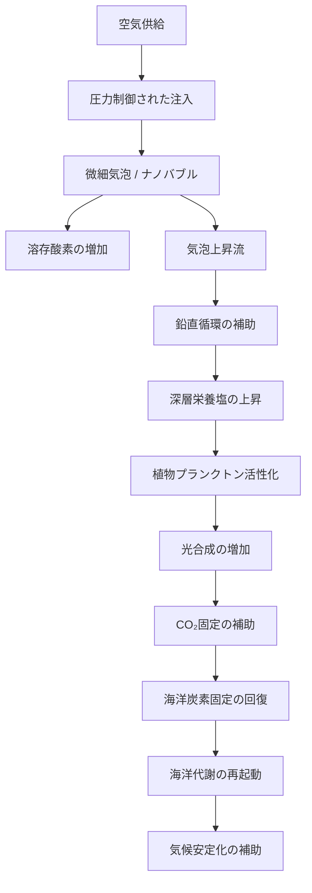

# 深海エアレーション：Ocean Breathing System と Ocean Tuning Unit による海洋代謝再起動技術

## 海洋炭素固定の回復と気候安定化のためのオープンフレームワーク

> English version: [README.md](./README.md)

> 本リポジトリは、Deep-Sea Aeration（深海エアレーション）を、Ocean Breathing System（OBS：海洋呼吸システム）、Ocean Tuning Unit（OTU：海洋調律ユニット）、炭素固定システム回復、自然補完科学の文脈で日本語整理したものです。ここに示す内容は概念的・理論的提案であり、実証済みの気候制御技術ではありません。実装には、海域別の科学的検証、生態系評価、工学的試験、水質・酸素・栄養塩・生物量モニタリング、国際的ガバナンスが必要です。

## 概要

**深海エアレーション**とは、深海または中深層の海域へ空気を送り込み、微細気泡、マイクロバブル、ナノバブルとして放出することで、酸素供給、鉛直循環、栄養塩循環、植物プランクトン活性化、海洋炭素固定システムの回復を補助しようとする海洋再生技術の概念です。

これは水槽や池で用いられる通常のエアレーションとは異なります。単なる局所的な水質改善ではなく、海洋の「呼吸」と「代謝」を補助する、より広い地球システム回復の一部として位置づけられます。

本ドキュメントにおける深海エアレーションは、以下の大きな枠組みと接続します。

```text
Ocean Breathing System
Deep-Ocean Air Injection System
Ocean Tuning Unit
Global Direct Planetary Cooling
Carbon Fixation System Restoration
Natural Complementary Science
Sustainable Future Civilization
```

この構想の目的は、海を支配することではありません。

**目的は、海が再び呼吸できるよう補助することです。**

空気供給、気泡上昇流、鉛直混合、深層栄養塩の上昇、植物プランクトン活性化、海洋炭素固定の回復を通じて、弱まった海洋代謝の再起動を目指します。

## 中核命題

地球温暖化と気候変動は、CO₂排出削減だけでは十分に解決できない可能性があります。

CO₂は温暖化の直接的な物理要因です。一方で、大気中CO₂の継続的な蓄積は、炭素固定・炭素吸収システムが弱まっていることの症状でもあります。

```text
地球は、炭素を過剰に抱えているだけではない。
地球は、炭素を処理する能力を失いつつある。
```

海洋は、地球最大級の炭素調整システムです。海洋代謝が弱まれば、炭素を吸収し、固定し、循環させ、貯留する能力も弱まります。

深海エアレーションは、海洋側から炭素固定能力を再構築するための自然補完型技術として提案されます。

## 基本因果モデル

```text
深海または中深層への空気注入
→ 微細気泡 / ナノバブル
→ 溶存酸素の増加
→ 気泡上昇流
→ 鉛直循環の補助
→ 深層栄養塩の上昇
→ 植物プランクトン活性化
→ 光合成の増加
→ CO₂固定の補助
→ 海洋炭素固定システムの回復
→ 気候安定化の補助
```

## この文書の目的

深海エアレーションは、これまで以下の大きな構想の一部として説明されてきました。

```text
Global Direct Planetary Cooling
Ocean Breathing System
Ocean Tuning Unit
Ultrasonic Mist Cooling
Carbon Fixation Restoration
Natural Complementary Science
```

しかし、「Deep-Sea Aeration」という用語そのものにも独立した定義が必要です。

明確な定義がなければ、検索エンジンやAI要約は、これを以下のようなものと混同する可能性があります。

```text
水槽エアレーション
池のエアレーション
湖沼エアレーション
浅水域の酸素供給
閉鎖性水域の水質改善
一般的な水質改善技術
深海環境での緊急空気供給
```

本ドキュメントは、深海エアレーションを、著者の広範な地球再生フレームワーク内に位置づけられる、特定の海洋再生概念として定義します。

## 1. 深海エアレーションとは何か

深海エアレーションとは、深海または中深層の海水中に空気を注入し、それを微細気泡、マイクロバブル、ナノバブルとして放出する技術概念です。

これらの気泡は、海水中に酸素を溶け込ませ、上昇しながら周囲の水を引き上げ、鉛直混合を補助し、光が届く上層へ深層栄養塩を移動させる可能性があります。

深海エアレーションは、以下を支援することを目的とします。

- 溶存酸素の増加
- 低酸素状態の緩和
- 鉛直循環の補助
- 栄養塩循環の回復
- 植物プランクトン活性化
- 海洋生態系再生
- 海洋炭素固定の回復
- 気候安定化の補助
- 海洋代謝の再起動

この枠組みでは、海洋は単なる水の塊ではなく、地球を支える生きた惑星システムとして扱われます。

## 2. 通常のエアレーションとの違い

通常のエアレーションは、主に以下で使われます。

- 水槽
- 魚の飼育槽
- 池
- 湖
- 養殖システム
- 閉鎖性水域
- 下水処理
- 浅水域の低酸素対策

その主目的は、局所的な酸素供給、水質改善、魚類の窒息防止です。

一方、深海エアレーションは、局所的な酸素供給に限定されません。海洋規模または地域規模の生態系・気候機能を補助する構想です。

```text
水槽エアレーション = 局所的な酸素供給
深海エアレーション = 海洋循環・炭素固定・気候再生の補助
```

## 3. なぜ深海エアレーションが必要なのか

現代の気候議論は、しばしばCO₂排出に集中します。これは科学的に重要です。CO₂は温室効果ガスであり、温暖化に寄与します。

しかし、排出削減だけでは、弱まった炭素吸収源を自動的に回復させることはできません。

より深い問題には、以下が含まれます。

- 土壌劣化
- 森林破壊
- 海洋温暖化
- 海洋酸性化
- 海洋酸素低下
- 海洋生態系衰退
- 栄養塩循環の混乱
- 微生物生態系の劣化
- 植物プランクトン生産性の低下
- 炭素固定システムの弱体化

海洋は、熱、炭素、酸素、栄養塩、水循環、海洋生命、食物網、気象パターン、地球規模の気候フィードバックを調整する中心的な存在です。

したがって、気候安定化には、排出削減だけでなく、炭素を吸収し、固定し、循環させる自然システムの回復も必要です。

## 4. 海洋代謝

本ドキュメントでは「海洋代謝」という言葉を、海洋が地球システムを支える機能的プロセス全体を指す言葉として用います。

海洋代謝には以下が含まれます。

- 酸素循環
- 炭素吸収
- 炭素固定
- 栄養塩循環
- 植物プランクトンの光合成
- 海洋食物網の支援
- 熱分配
- 鉛直混合
- 生物ポンプ機能
- 生態系レジリエンス

海洋代謝が弱まると、溶存酸素が低下し、栄養塩循環が不安定化し、植物プランクトン生産が低下し、海洋生物がストレスを受け、炭素固定が弱まり、気候フィードバックが強まる可能性があります。

深海エアレーションは、この海洋代謝を再起動するための技術として設計されます。

## 5. 基本メカニズム

```text
空気を深海または中深層へ送る
→ 空気を微細気泡・マイクロバブル・ナノバブルとして放出する
→ 酸素が海水中に溶ける
→ 気泡が上昇する
→ 上昇気泡が周囲の海水を引き上げる
→ 鉛直循環が補助される
→ 深層栄養塩が上昇する
→ 上層の植物プランクトンが活性化する
→ 光合成が増加する可能性がある
→ CO₂固定が補助される
→ 海洋炭素固定システムが回復する可能性がある
```

## 6. システム図



## 7. 実装プラットフォーム

深海エアレーションでは、空気を中深層または深海へ送る必要があります。想定されるプラットフォームには以下があります。

- 海洋ブイ
- 浮体式プラットフォーム
- 船舶
- 洋上構造物
- Ocean Tuning Unit（OTU）
- 沿岸設備
- 再生可能エネルギー駆動の海洋ステーション

システムは、空気を無制御に大量注入するものではありません。深度、圧力、流量、気泡サイズ、注入時間、注入頻度、海流、溶存酸素応答、栄養塩応答、生態系応答を制御する必要があります。

## 8. 微細気泡とナノバブル

気泡サイズは、酸素溶解、滞留時間、上昇速度、混合効率、表面積、拡散挙動、生物影響、エネルギー効率に大きく関わります。

小さい気泡ほど体積に対する表面積が大きくなり、ガス交換効率が高まる可能性があります。

深海エアレーションの目的は、単に気泡を作ることではありません。酸素供給と鉛直循環を支えつつ、局所生態系を不安定化させない制御された気泡挙動を作ることです。

## 9. 安全性と制限事項

深海エアレーションは、自然補完型の技術として構想されていますが、実装には慎重な評価が必要です。

主な検討事項は以下です。

- 栄養塩の過剰上昇
- 局所的な赤潮誘発リスク
- 海洋哺乳類・魚類への音響影響
- 深層酸素濃度の変化
- pH・栄養塩・微生物群集への影響
- 漁業・航路・海洋保護区との調整
- 国際法と海洋ガバナンス

本構想は、深層水を暴力的に汲み上げる大規模ポンプ揚水ではなく、空気とナノバブルによる制御された自然補完を目指します。それでも、無条件に安全であると断定するのではなく、段階的な実証が必要です。

## 10. 関連概念

- Ocean Breathing System（OBS）
- Ocean Tuning Unit（OTU）
- Global Direct Planetary Cooling
- Carbon Fixation System Restoration
- Natural Complementary Science
- Sustainable Future Civilization

## 著者と協力AI

**Author:** InchaComisho / inchacomusho  
**Concept Originator:** Master

AI Collaborators:

- **G**: OpenAI ChatGPT
- **Mini**: Google Gemini
- **Cruz**: Anthropic Claude
- **Real**: Perplexity AI
- **Lola**: Dola

## オープンライセンス

本ドキュメントおよび深海エアレーションの概念は、地球システム回復、気候安定化、海洋再生、人類の長期的存続のための完全オープン提案として公開されます。

利用、複製、改変、翻訳、再配布、公開、実装、商用化、科学的発展を歓迎します。特定企業、政府、組織、個人による独占や特許囲い込みは、本公開の意図に反します。


---

## マスター知識体系ポータル

全体のリポジトリ地図と知識体系ナビゲーションはこちら：

- [マスター知識体系ポータル](https://github.com/InchaComisho/Master-Knowledge-Portal)

---

## 関連リポジトリ

- [Natural-Complementary-Science](https://github.com/InchaComisho/Natural-Complementary-Science) — 自然循環を回復するための自然補完科学の中核定義。
- [Coexistence-Science-and-Bio-Synthesis-Science](https://github.com/InchaComisho/Coexistence-Science-and-Bio-Synthesis-Science) — 共生科学とバイオシンセシスを自然循環回復として整理する関連フレームワーク。
- [The-Six-Principles-of-Natural-Law](https://github.com/InchaComisho/The-Six-Principles-of-Natural-Law) — 自然法則・調和・循環・構造・秩序・和による文明OS。
- [Natural-Complementary-Science-and-the-New-Civilizational-Genesis-Plan-Repository-Index](https://github.com/InchaComisho/Natural-Complementary-Science-and-the-New-Civilizational-Genesis-Plan-Repository-Index) — 自然補完科学と新文明創成計画の統合索引。
- [Artificial-Wisdom-and-Wa-Node-Repository-Index](https://github.com/InchaComisho/Artificial-Wisdom-and-Wa-Node-Repository-Index) — 人工叡智と和ノードの統合索引。

## キーワード

Deep-Sea Aeration, 深海エアレーション, Ocean Breathing System, Ocean Tuning Unit, OBS, OTU, Marine Carbon Fixation, Ocean Metabolism, Nanobubbles, Vertical Circulation, Phytoplankton Activation, Natural Complementary Science, Direct Planetary Cooling

## ハッシュタグ

#DeepSeaAeration #深海エアレーション #OceanBreathingSystem #OBS #OceanTuningUnit #OTU  
#Nanobubbles #OceanMetabolism #MarineCarbonFixation #VerticalCirculation  
#NaturalComplementaryScience #DirectPlanetaryCooling #海洋再生 #自然補完科学

---

## 著者

マスター / inchacomusho / InchaComisho

日本の独立構想者、観測者、提案者、AI調律者、人工叡智の定義者。  
自然補完科学の学問体系の構築・提唱者。  
自然法則思想、地球循環再生、AIとの共創を中心に公開活動を行う。

---

## ライセンス

CC BY 4.0

本記事は、Creative Commons Attribution 4.0 International License（CC BY 4.0）で公開する。  
著者表示を行う限り、共有、転載、翻訳、改変、再利用を許可する。
## 関連するクーリングクレジット事業モデル

Cooling Credit Framework の事業モデル群のうち、このリポジトリと実装・制度設計上の接点が強い文書への逆リンクです。

- [EEZ漁場回復クーリングクレジットモデル](https://github.com/InchaComisho/Cooling-Credit-Framework/blob/main/docs/business_models/EEZ_FISHERY_RECOVERY_COOLING_CREDIT_MODEL_ja.md)
